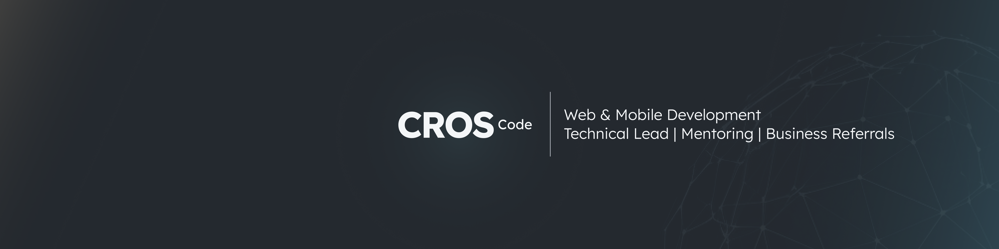

## Web & Mobile Development • Consulting • Audit • Training

Support for organizations across product design and architecture, custom web and mobile development, as well as consulting, audits, and training, leveraging modern technologies (React/Next.js, React Native/Expo, Node.js, REST/GraphQL, PostgreSQL/MongoDB) and a Domain‑Driven Design (DDD) approach aligned with the business domain; infrastructure capability available (Docker, managed services like Google Cloud/AWS) when needed to secure deployments and CI/CD without positioning it as the primary focus.

### Contact

- Website: https://oriancros.com
- Email: contact@oriancros.com
- LinkedIn: https://www.linkedin.com/in/orian-cros

_®CROS.Code — Support your business._
